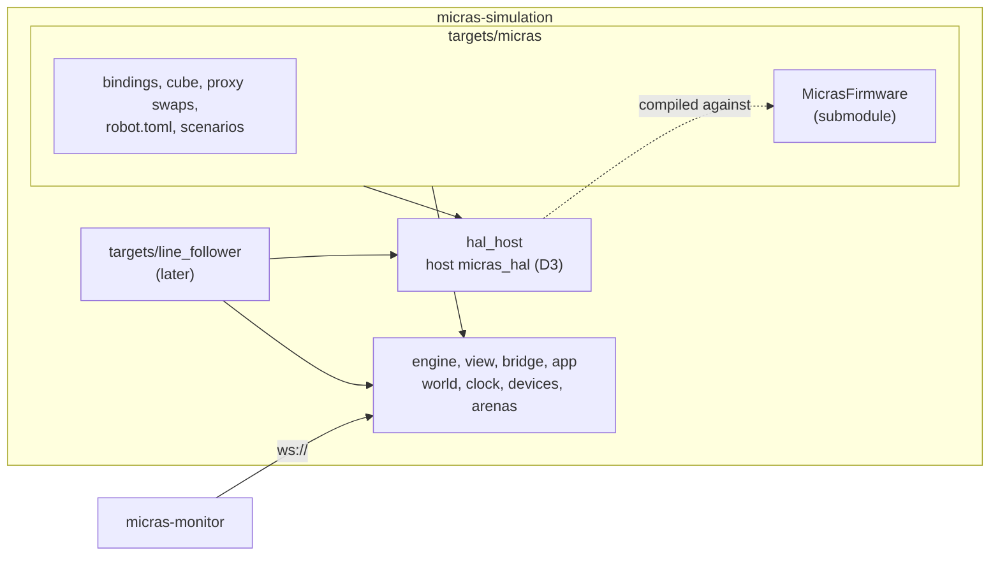
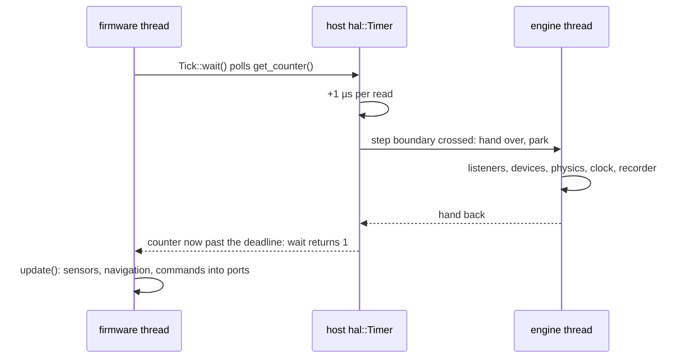

# Spec 2 — Decisions

2026-09-23 · companion to [`SPEC_1_WORK.md`](SPEC_1_WORK.md)

This simulator serves every robot built on `micras_hal`: the micromouse now, and a
line follower later. All fourteen decisions that shape it are made. This
document records each one with the options it was chosen over, so the reasons stay
visible.

Out of scope for now, by decision:

- CI, in both repositories
- running the firmware's hardware tests in the simulator; the design supports them
  (2.5), but nothing is built for them yet

**Implemented** on `refactor/cleanup` (2026-09-24, not yet committed); where the
implementation departs from a decision below, spec 1 section 12 says how and why.

Section 2 walks through the end state. Section 14 holds the robot's physical data,
prefilled from `hw_debug`, `MicrasHardware` and the datasheets, with the remaining
gaps left for you.

---

## 1. Summary

| # | Decision | Decided |
|---|---|---|
| D1 | Where the simulator plugs into the firmware | **Hybrid:** a host `micras_hal` backend (`Gpio`, `Pwm`, `PwmDma`, `AdcDma`, `UartDma`, `Flash`, `Mcu`, `Timer`, `Crc`); only `Imu` and `RotarySensor` swapped |
| D2 | The loop | **Two threads:** the host `hal::Timer` charges a quantum per read and hands over at every simulation step; the firmware's `main` and the tests run unchanged |
| D3 | Where the host `micras_hal` lives | **In the simulator for now** (`hal_host/`), next to `micras_hal` later |
| D4 | Fake STM32 Cube layer | **Hand-written.** The `.ioc` does not hold every value it needs (section 6) |
| D5 | How firmware variables reach the recording | **A read-only accessor** on `Micras`, a firmware change at the port |
| D6 | Dependencies | **Git submodules** for every dependency you own, CMake fetch for third-party ones. Robot targets stay in this repository |
| D7 | Where the robot model comes from | **`robot.toml`, written by hand** from the CAD, the board and the datasheets; MJCF generated from it. Neither `robot.hpp` nor the CAD holds everything (section 9) |
| D8 | Physical fidelity and noise | **From the datasheets**, with seeded noise on by default |
| D9 | Arenas | **Maze only for now,** in its own folder |
| D10 | Baselines | **Hashes and summaries stored;** byte identity checked on one machine until a pinned container exists |
| D11 | Recording at 8 kHz | **CSV with `--record-every N`;** events detected at full rate into `meta.json` |
| D12 | Panel and overlay extensions | **Declarative** |
| D13 | Scenarios and commands | **TOML scenario files** plus generic CLI overrides |
| D14 | Smaller decisions | As listed in section 13 |

---

## 2. The end state, walked through

### 2.1 Where each piece lives

Everything lives in this repository:



- **The engine:** world, clock, devices (motor, IR sensor, IMU, encoder, battery,
  UART, …), arenas, recording, viewer and bridge. It knows no robot and no HAL.
- **`hal_host/`:** `micras_hal` implemented on a PC (D3). It is compiled against the
  `micras_hal` headers of whichever robot is being built, and it has no dependency on
  the engine, so it can move next to `micras_hal` later without changes.
- **`targets/micras/`:** the Micras target. It holds the firmware as a submodule
  (D6). The firmware repository itself gains nothing. A line follower would get its
  own `targets/line_follower/`.

### 2.2 The hybrid seam (D1, decided)

The simulator compiles the firmware's own headers, including the real
`config/targets/v1/target.hpp`, `constants.hpp` and `robot.hpp`. Per firmware class:

| Class | How it runs in simulation | Why |
|---|---|---|
| `hal::Gpio`, `hal::Pwm`, `hal::PwmDma`, `hal::AdcDma`, `hal::UartDma`, `hal::Flash`/`FlashWord`, `hal::Mcu` | **Host backend** (`hal_host/`) | The peripheral is simple to emulate: a level, a duty cycle, a buffer of ADC scans, a byte queue, a byte array. |
| `hal::Timer` | **Host backend** | The only place time exists. Each read costs a fixed quantum and crossing a simulation step hands over to the engine thread (D2). It wraps at 32 bits exactly as the cycle counter does at 550 MHz (every 7.8 s). With it, the real `Tick` and `Stopwatch` run. |
| `hal::Crc` | **Host backend**, though nothing calls it today | A software CRC driven by the same `hcrc.Init` fields that `MX_CRC_Init` sets: 8-bit polynomial 0x1D, initial value 0xC4, no reflection, the AS5047U frame check. It computes what the peripheral does, so it is ready for an encoder model and usable in host tests. |
| `Led`, `Button`, `TDipSwitch`, `Buzzer`, `TArgb`, `Motor`, `Locomotion`, `Fan`, `Battery`, `TTorqueSensors`, `TWallSensors`, `BluetoothSerial`, `Storage`, `Watchdog`, `Tick`, `Stopwatch` | **Real proxy**, unchanged, over the host backend | Their logic is tested: wall range model, locomotion saturation, storage format, debounce, loop pacing. |
| `Imu`, `RotarySensor` | **Swapped** `.cpp` in the robot target | At HAL level they are SPI register protocols (the LSM6DSV with ST's driver, the AS5047U with CRC frames). Emulating those costs a lot and teaches nothing. |
| `hal::Spi`, `hal::Encoder` | **Host backend**, as implemented | `hal::Encoder` reads an `EncoderPort` the encoder device writes, and the swapped rotary sensor proxy reads it; `hal::Spi` is chipless, a place for a chip model to go. |
| `hal::Fmac` | **Not implemented** | Only the unused `FmacFilter` calls it, and it is left out of the build. |

The HAL headers name STM32 handle types in their configs, so the simulator needs a
small fake Cube layer (D4):

- the handle types, including `CRC_HandleTypeDef` with its real `Init` fields
- 15 handle objects
- 17 `MX_*_Init` functions; `MX_CRC_Init` fills `hcrc.Init` with the values from the
  `.ioc`
- about 11 constants and about 11 pin names

The HAL headers have no inline bodies, so every call already goes through a `.cpp`
that the host backend replaces. The firmware's `tests/host` uses the same pattern: it
compiles the real `storage.cpp` against a stub `hal/flash.hpp`.

What the hybrid gives up, and why that is acceptable:

- **The IMU and encoder protocol code is never exercised.** That code is tested on
  the robot.
- **The two swapped `.cpp` files must track their headers.** A mismatch is a compile
  error, never silent drift.
- **The line moves if needed.** A future robot using another SPI chip gets a proxy
  swap, or a chip model behind the host `Spi`.

### 2.3 What `targets/micras/` contains

```
targets/micras/
  MicrasFirmware/    the firmware, as a git submodule (D6)
  CMakeLists.txt     added by the root CMakeLists; links the engine and hal_host, and
                     compiles the firmware sources of 2.4 and the files below
  cube/              fake STM32 Cube headers (main.h, adc.h, tim.h, spi.h, usart.h, gpio.h,
                     crc.h, dma.h, fmac.h) and handles.cpp (hadc1 ... huart4, MX_*_Init)
  proxy/             imu.cpp, rotary_sensor.cpp
  bindings.cpp       which host-backend port drives which engine device (2.6)
  robot.toml         the real robot's physical description (D7, from section 14)
  scenarios/         idle, explore, solve, calibrate (D13)
  baselines/         hashes and summaries (D10)
  analysis.py        the Micras plugin for the simulator's analyze
```

There is no `main.cpp` and no `test_core.hpp` in the target. The firmware's own `main`
and the hardware tests' own `main` and `TestCore` run unchanged (2.5).

Nothing is added to the firmware repository, so its ARM build is untouched.

### 2.4 How it builds

```bash
just build
./build/default/targets/micras/micras_sim --scenario targets/micras/scenarios/explore.toml --out runs/explore
```

`targets/micras/CMakeLists.txt` compiles, with the host compiler, from the
`MicrasFirmware/` submodule:

- **Unchanged firmware:**
  - `micras_core/src`, `micras_nav/src`, `micras_comm/src`
  - `src/*.cpp` and `src/states/*.cpp`, **including `main.cpp`**
  - `micras_proxy/src/*.cpp`, except `imu`, `rotary_sensor` and `fmac_filter`
- **The firmware's `main`:** compiled with `-Dmain=micras_firmware_main`. The
  process `main` is the engine's, and it runs the renamed one on the firmware thread.
  A hardware test would build the same way, with its own `main`, once the tests are
  in scope.
- **The host backend:** `hal_host/*.cpp` from the simulator, instead of
  `micras_hal/src/`.
- **Include order:** the target's `cube/` first, then `include`, `config`, `config/targets/v1`,
  and each package's `include`.
- **Flags:** C++23. Under clang, `-fconstexpr-steps` is needed for the constexpr
  `TurnTable`, as the firmware's lint script already sets.

### 2.5 The loop: two threads, handed over by the host `Timer` (D2, decided)

The firmware runs exactly as on the robot, on its own thread:

- **the application:** `main` calls `hal::Mcu::init`, then
  `while (true) micras.update();`
- **each hardware test:** its `main` calls `TestCore::init` and `TestCore::loop`

The engine runs on the process's main thread. The two threads **never run at the same
time**: a mutex and a condition variable hand control from one to the other. So there
is no data race, and the firmware's state can be read freely while it is parked.

**Time exists only in the host `hal::Timer`.**

- Every `get_counter()` or `get_counter_ms()` call costs a fixed quantum of
  simulated time, for example 1 µs (550 cycles).
- The counter wraps at 32 bits, exactly as the DWT cycle counter does at 550 MHz.
- When a read crosses the next simulation step boundary, the firmware thread hands
  over and parks. The engine runs that step:
  - before-step listeners: scenario events, bridge bytes into the UART port
  - devices actuating from their ports
  - physics and the clock
  - devices sampling into their ports: ADC scans, with `on_sequence_complete` called
    as the DMA interrupt would
  - after-step listeners: recorder, bridge TX, viewer

  Then the engine hands back, and the read returns.
- The quantum is small enough that the handful of timer reads in one `update()` stays
  far below the 125 µs period. Only an actual wait advances time much.



Why this needs no custom code anywhere:

- **Application:** `Tick::wait()` polls the timer until a period has passed. The step
  boundaries it crosses run the physics, exactly where time passes on the robot.
- **Tests:** `sleep_ms(3000)` polls until 3 s have passed, so 24 000 steps run.
  `while (button.get_status() == NO_PRESS) button.update();` reads the stopwatch on
  every pass, so steps run until the scenario presses the button. The same holds for
  `while (fan.update() < max_speed)`.
- **The `Imu` constructor's `sleep_ms(10)`** would also work, if `Imu` ever ran for
  real.

Ending a run, and the limits:

- **Ending a run.** After the last step, the engine writes the outputs and wakes the
  parked firmware thread with a stop flag. The timer read throws `RunFinished`, which
  unwinds out of the firmware's `main`, and the thread is joined. That is the same
  mechanism the current `FirmwareThread` uses. Nothing in the firmware is `noexcept`
  on that path.
- **A loop that never reads the timer would hang.** For example, a tight GPIO poll.
  Nothing in the application or the tests does that. A wall-clock watchdog on the
  engine thread reports it with the step number instead of hanging silently.
- **Time inside `update()` is the number of timer reads times the quantum.** It is
  deterministic, but it does not measure anything: `worst_loop_time_us` means
  nothing in simulation, and CPU overload cannot show.
- **The firmware's `SIGABRT` handler** replaces the simulator's crash reporter. The
  host `Mcu::emergency_stop()` therefore prints "firmware aborted at step N" itself.
- **Handover cost.** About one million handovers per 120 s run at 8 kHz. Measure it at
  the port (spec 1 R14); if it is significant, a spinning handover replaces the
  condition variable.

**Recording is per simulation step,** not per firmware iteration: the engine no longer
sees `update()` calls. Each row is a consistent snapshot, because the firmware is
parked while it is taken, usually inside `Tick::wait()`, between two iterations. With
the timestep equal to the 125 µs period, that is one row per loop period, as before.

### 2.6 How a GPIO write reaches the simulation, and what `bindings.cpp` connects

Take `Led::turn_on()` as the example.

**1. The firmware call is the same on the robot and on the PC.** `Led` holds a
`hal::Gpio` built from `led_config` in the real `target.hpp`:
`.port = LED_Red_GPIO_Port`, `.pin = LED_Red_Pin`. `turn_on()` calls
`hal::Gpio::write(true)`.

**2. Only the body of `write()` differs.**

- **On the robot**, `micras_hal/src/gpio.cpp` writes the STM32 set/reset register:

  ```cpp
  this->port->BSRR = state ? this->pin : static_cast<uint32_t>(this->pin) << reset_offset;
  ```

- **On the PC**, the build compiles `hal_host/gpio.cpp` instead. It has the
  same header and the same class, but stores the level in a port object:

  ```cpp
  Gpio::Gpio(const Config& config) : port{config.port}, pin{config.pin} { }

  void Gpio::write(bool state) {
      host::Board::gpio(this->port, this->pin).set(state);
  }

  bool Gpio::read() const {
      return host::Board::gpio(this->port, this->pin).get();
  }
  ```

  In the fake `main.h`, `GPIO_TypeDef` is an empty struct, `GPIOA`…`GPIOK` are
  pointers to static instances of it, and `LED_Red_GPIO_Port`/`LED_Red_Pin` are the
  same CubeMX labels mapped to them. So `(port, pin)` is a unique key.
  `host::Board::gpio(port, pin)` returns the one `GpioPort` for that key and
  creates it on first use. A port is a few fields: the level driven by the firmware,
  the level driven from outside, and a flag saying whether the firmware ever touched
  it. `host::Board` knows nothing about MuJoCo.

**3. The robot target's `bindings.cpp` connects ports to engine devices.** It runs
before `Micras` is constructed. Engine devices take plain callables, so the engine
never sees a HAL type, and the HAL backend never sees the engine:

```cpp
void bind_devices(sim::World& world) {
    auto& led = hal::host::Board::gpio(LED_Red_GPIO_Port, LED_Red_Pin);
    world.add<sim::Indicator>("led", [&led] { return led.get(); });

    auto& button = hal::host::Board::gpio(Button_GPIO_Port, Button_Pin);
    world.add<sim::PushButton>("button", [&button](bool pressed) { button.drive(not pressed); });

    auto& forward = hal::host::Board::pwm(&htimN, TIM_CHANNEL_x);
    auto& backward = hal::host::Board::pwm(&htimN, TIM_CHANNEL_y);
    world.add<sim::HBridge>(
        "left_bridge", [&] { return forward.duty() - backward.duty(); }, world.motor("left")
    );
}
```

The handles and channels in the motor lines stand for whatever `target.hpp` names.

**4. Timing.** During `update()`, the firmware writes ports and nothing else happens.
On the next tick, when the engine advances, every device samples the ports it is bound
to:

- the indicator shows the LED on the panel
- the H-bridge turns the duty cycles into a motor voltage, the motor into a torque,
  and MuJoCo steps

Inputs run the other way. The panel or a scenario presses the button, the device
drives the port, and the firmware's next `read()` sees it. Every output is
therefore sampled once per tick (125 µs), which is far below any mechanical time
constant.

**5. Unbound ports are reported.** After the firmware is constructed, the engine
lists every port the firmware touched that no device is bound to. That is a warning
in normal runs and a failure in the gate, so a re-pinned board or a forgotten
binding is loud.

The same pattern covers every host HAL class:

| Firmware object | Host backend port | Engine device |
|---|---|---|
| `Motor` left and right | 2 PWM ports each (forward, backward) | H-bridge channel, DC motor, gearbox, wheel joint |
| `Locomotion` enable | GPIO port | H-bridge enable |
| `Fan` | PWM port and an enable GPIO port | Fan motor, then downforce |
| `TWallSensors<4>` | ADC port (lit and dark scans, sequence counter) and 4 emitter PWM ports | IR emitter/receiver pairs: rays to the walls, then ADC counts, written into the ADC port at 2 kHz |
| `Battery` | ADC port | Battery model to counts |
| `TTorqueSensors<2>` | ADC port | Motor current through the sense amplifier to counts |
| `Imu` | none (swapped proxy) | IMU device at its mount pose |
| `RotarySensor` ×2 | none (swapped proxy) | Wheel encoders |
| `Button`, `TDipSwitch<4>`, `Led` | GPIO ports | Panel and scenario digital I/O |
| `TArgb<2>` | PWM-DMA port | Decoded colours on the panel |
| `Buzzer` | PWM port | Tone shown on the panel |
| `BluetoothSerial` | UART port (byte queues both ways) | Byte channel (baud-limited, D8), to the bridge and micras-monitor |
| `Storage` | Flash port (a byte array) | In memory, optionally a file (D14) |
| `Watchdog` | MCU port (refresh counter) | Reported in `meta.json` (D14) |

For DMA peripherals the port also replaces the interrupt:

- When the IR device finishes a scan, the ADC port copies it into the buffer the
  firmware gave `start_dma`, bumps the sequence counter, and calls
  `AdcDma::on_sequence_complete`, exactly as the DMA interrupt does on the robot.
- For the UART, bytes the firmware passes to `start_tx` go to the TX queue, and
  bytes from the bridge are written into the circular RX buffer the proxy polls.

### 2.7 When the firmware changes

A firmware change reaches the simulator when its submodule is bumped. That bump, and
anything it breaks, land in one commit here.

| Change in MicrasFirmware | What the submodule bump needs |
|---|---|
| A proxy that runs for real | Nothing: it is compiled as it is. |
| `Imu` or `RotarySensor` | If the header changed, the swap fails to compile; fix it in the same commit. |
| A HAL class | `hal_host/` fails to compile; fix it in the same commit. |
| `target.hpp` pins or handles | A new handle is a compile error in `cube/`; a moved channel is a binding error at startup. |
| `constants.hpp`, `robot.hpp` | Nothing. `robot.hpp` is the firmware's *belief*; `robot.toml` is the physical truth (D7). |

CI is out of scope for now.

### 2.8 A line follower

A new `micras_hal` robot gets the host backend and the engine for free, in its own
`targets/line_follower/`. It needs:

1. its firmware as a submodule, and its hand-written fake Cube layer (D4)
2. swaps for any SPI-chip proxies it has
3. `robot.toml` and bindings to engine devices
4. an arena: a line track (D9)
5. scenarios; no `main` of its own, as long as its waits read `hal::Timer`

New engine devices only appear for new sensor kinds, such as a downward reflectance
array.

### 2.9 Getting there from today

Spec 1 builds this end state in place: the engine at the repository root, the host
backend in `hal_host/`, and the Micras target in `targets/micras/`. Nothing moves to
another repository.

`hal_host/` stays here until `micras_hal` gets its own repository. Then it moves there
as `micras_hal/host/`, unchanged, because it depends on nothing but the HAL headers,
and `micras_hal` becomes a submodule of the robots that use it.

---

## 3. D1 — Decided: hybrid seam

Recorded for reference. The two alternatives it was chosen over:

- **Shadow proxies (today's approach).** Rejected: it duplicates about 3200 lines,
  4 proxies are already stale, and it needs drift tooling forever.
- **Pure HAL, including SPI chip models.** Rejected for now: emulating the LSM6DSV
  and AS5047U register protocols is expensive and only exercises code that is tested
  on the robot.

The split is in 2.2. One optional firmware change costs nothing at runtime:
`TWallSensors` reads `config.adc.handle->Init.NbrOfConversion` in its constructor.
Moving that check into `hal::AdcDma` (for example `get_sequence_length()`) lets the
fake ADC handle be an opaque type. It runs once, at construction.

---

## 4. D2 — Decided: two threads, handed over by the host `Timer`

**Decided:** the firmware runs unchanged on its own thread, including its `main` and
the tests' `TestCore`. The host `hal::Timer` charges a fixed quantum per read, and
hands over to the engine whenever a read crosses a simulation step (2.5).

What it was chosen over:

| Alternative | Why not |
|---|---|
| A custom `main` (advance, `update()`, record) plus a custom `TestCore` with polled time for the tests | Two mechanisms, one for the application and one for the tests, and two reimplemented firmware files. The chosen design uses one mechanism, reimplements nothing, and exercises the firmware's real `main` too. |
| Swapped `Tick` and `Stopwatch` that step the engine | Custom proxies. A swapped `Stopwatch` would not even cover the tests, whose waits mostly only read the stopwatch. |
| Today's thread handoff | It yields when the same instant is read two or four times, and those thresholds are spread over `Stopwatch` and `Button`: the most fragile code in the repository. The chosen rule is fixed, in one function, with no guessing. |
| Rewriting the tests without inner waits | Changes 16 firmware tests, and changes them on the robot too. |

What it costs is listed in 2.5: a handover per step, a hang if a loop waits without
reading the timer (reported by the watchdog), and a "new run" that needs a new
process, because the firmware's `static Micras` cannot be rebuilt.

---

## 5. D3 — Decided: `hal_host/` lives in the simulator for now

**Decided:** the host `micras_hal` stays in this repository and moves next to
`micras_hal` later, most naturally when `micras_hal` gets its own repository.

Two properties keep that later move free:

- **No engine dependency.** `hal_host/` implements each HAL class over small port
  objects (2.6) and includes nothing from the engine. The robot's bindings connect
  ports to devices. The host `Timer`'s handover at each step is a plain callback that
  the engine installs at startup, so the dependency stays one way.
- **Built against the consumer's headers.** `hal_host/` is not compiled on its own.
  The simulator exports its sources, and each robot target compiles them against its
  own `micras_hal` headers and fake Cube layer.

The cost while it lives here: a `micras_hal` API change breaks `hal_host/` when the
firmware submodule is bumped, and the fix goes in the same commit (2.7).

## 6. D4 — Decided: the fake STM32 Cube layer is hand-written

The HAL configs name STM32 handle types, and `target.hpp` names handles, init
functions, channel constants and CubeMX pin labels. For Micras v1 that means:

- 15 handles
- 17 `MX_*_Init` functions
- about 11 constants
- about 11 pin names

The host HAL also needs some initial register values. For example,
`hal::Pwm::get_frequency()` reads the timer's prescaler, period and counter mode, and
`TWallSensors` refuses to initialise unless it gets 2 kHz.

**Rule:** derive it from the `.ioc` only if the `.ioc` holds absolutely every value.
**It does not:**

| Needed | In `micras_v1.ioc`? |
|---|---|
| Pin labels, ports and numbers (`PB5.GPIO_Label=…`) | Yes |
| Timer prescaler, period, counter mode when not the default; timer clocks (`RCC.Tim1OutputFreq_Value`, …) | Yes |
| ADC sequence lengths (`NbrOfConversion`) | Yes |
| **Parameters left at their CubeMX default**, e.g. the CRC's input/output inversion and input format, TIM1's counter mode | **No.** The `.ioc` stores only what differs from CubeMX's defaults database |
| **Handle and init-function names** (`hadc1`, `MX_ADC1_Init`) | **No.** They follow CubeMX's code-generation conventions |
| HAL library constants (`TIM_CHANNEL_1`, `SPI_POLARITY_LOW`, …) | **No.** They come from ST's HAL headers |

The complete, explicit values do exist in the CubeMX-generated sources
(`cube/Inc/main.h`, `cube/Src/*.c`). But those are gitignored and produced by CubeMX at
build time, so deriving from them would make the simulator depend on CubeMX.

**Decided: hand-written,** about 100–150 lines in `sim/cube/`. Each value names the
generated line it mirrors, for example `hcrc.Init.InitValue = 0xC4` from
`cube/Src/crc.c`. A CubeMX change that renames a handle or a pin becomes a compile
error; a changed prescaler or period shows up as a wrong frequency at initialisation.

---

## 7. D5 — Decided: firmware variables through a read-only accessor

`Micras` registers its observable state (pose, reference, control errors, wall
readings, …) in a `core::TVariablePool<64>`. The pool is a private member with no
accessor. `comm::Link` serves it over a session protocol with one peer.

| | A. Read-only accessor | B. Recorder as a link peer | C. Not recorded |
|---|---|---|---|
| **How** | Add `const core::VariablePool& get_variables() const` to `Micras`. The recorder reads names and types once, then every variable each tick; BLOBs such as the maze are skipped. | The recorder speaks HELLO, SCHEMA_REQUEST, GROUP_DEFINE and GROUP_ENABLE in-process, and keeps returning credit. | Ground truth and device columns only. |
| **Upsides** | Every registered variable, every tick, typed and named by the firmware. The link stays free for micras-monitor. No protocol code in the simulator. Never called on the robot, so no code is generated: zero runtime cost. | No firmware change. Exercises the link. | Simplest. |
| **Downsides** | One firmware line whose only caller is the simulator. | The link has one peer, so the recorder and micras-monitor fight over it. Limited to 4 groups of 16 variables. Gaps when credit runs out. If D8 models the radio's bandwidth (about 11.5 kB/s), full-rate recording at 8 kHz is impossible. | Loses what navigation is validated with: pose estimate, reference, control errors. |

**Decided: A.** The accessor is added to the firmware at the port.

---

## 8. D6 — Decided: submodules for your dependencies

**Decided:** every dependency you own is a **git submodule**:

- MicrasFirmware, inside `targets/micras/`
- `micras_hal`, once it has its own repository

Third-party dependencies stay fetched by CMake: MuJoCo, IXWebSocket, ImGui, picosha2
and ST's LSM6DSV driver.

- **Gains:** an explicit commit per dependency, offline builds, and co-development by
  working directly inside the submodule checkout.
- **Costs:** `git submodule update` after every pull, and a bump commit whenever the
  dependency moves.
- **Alternatives:** FetchContent by tag (a download at configure time) and an
  installed package (an install step per developer).

Robot targets stay in this repository. CI is out of scope for now.

---

## 9. D7 — Decided: `robot.toml`, written by hand from the sources

The new firmware derives its controller gains, turn table, wall model and localizer
from `robot.hpp`'s `RobotModel`. The current MuJoCo robot disagrees with it:

| Quantity | `robot_v2.xml` | `robot.hpp` | v2 main board (CAD, section 14) |
|---|---|---|---|
| Wheel track | 62 mm (wheels at ±31 mm) | 42.25 mm (now 45.75) | 45.75 mm between tyre centres (42.25 is between the cutout centres) |
| Chassis | 66 × 99 mm (the v1 board) | 60 × 93.5 mm (now 50.2 × 91.4) | 50 × 90 mm |
| Forward axis | +y | +x | — |
| Side sensors (forward, lateral) | 41, 26 mm | 36.7, 21.5 mm | 36.72, 21.50 mm (footprint origin; the lens is 6.7 mm further) |
| Diagonal sensors (forward, lateral) | 61, 10 mm | 47.6, 10.2 mm | 47.57, 10.19 mm (same note) |
| Motor | affine actuator, hand-tuned | Kt 0.00711, R 21.9 Ω, gear 4, 20 V (now the datasheet values) | DCX 8 M 4.2 V at 19.63 V, gear 5.25 |

`CLAUDE.md` also records that Micrasverse models the robot as 50 × 80 mm. So there
were three different robots and no single source of truth. The board now settles
geometry, and `robot.hpp` has been corrected to it (section 14.13).

| | A. Hand-written MJCF (today) | B. Description file, MJCF generated | C. Generated from `robot.hpp` |
|---|---|---|---|
| **How** | Someone writes and tunes the XML. | `robot.toml` in a versioned schema: outline or mesh, component masses and positions, wheels, drive, sensors, IMU, fan. The engine generates the MJCF and configures the devices from the same file. | A generator includes the constexpr `robot_model`. |
| **Upsides** | Total freedom. | One file for physics and devices, readable without knowing MuJoCo. Every value carries a `source` (datasheet, CAD, estimate, measured). Seeded perturbations make robustness runs possible. The line follower reuses it. | No duplication. |
| **Downsides** | Error-prone, as the table shows; every robot has to learn MJCF. | A generator and a schema to maintain; limited to what the schema expresses, with an MJCF snippet include as the escape hatch. | The simulated robot *is* the firmware's belief, so errors in `robot.hpp` become invisible. It also lacks most physical items (masses, tyre, optics, battery) and is Micras-only. |

**Rule:** derive the model directly from an existing source only if that source holds
absolutely everything. **Neither does:**

- **`robot.hpp`** has no component masses or positions, no heights, no full inertia,
  no tyre, battery or fan, no sensor optics and no motor rotor inertia. It is also
  the firmware's belief, which the simulator must be able to contradict.
- **The CAD** has no materials or masses, no populated board (so no sensors), and
  only partial STEP exports. The complete assembly exists only as SolidWorks files.

**Decided: B.** `robot.toml` is written by hand from the CAD, the KiCad board and the
datasheets (section 14), and every value names its source. The MJCF is generated from
it.

- Frames follow `robot.hpp`: x forward, y left, z up, origin at the axle midpoint on
  the floor.
- The schema starts with what the micromouse needs. It grows when the line follower
  arrives, and it is versioned so older files keep loading.
- The Micras target ships a report comparing `robot.toml` with `robot.hpp`, field by
  field, which shows the differences without forcing them equal.

---

## 10. D8 — Decided: fidelity from the datasheets

The firmware's own notes warn that "a filter tuned against a noiseless simulator is
a filter tuned wrong". Today the simulator has no noise at all.

| | A. Ideal | B. Datasheet-level, seeded noise | C. B, calibrated from robot logs |
|---|---|---|---|
| **Upsides** | Simple, fast, easy to read. | The closest to reality reachable with static information only (section 14). Parameters traceable to datasheets; runs stay reproducible. | The closest possible. The firmware's `DriveIdentification` and gyro calibration already produce measured constants. |
| **Downsides** | Validates against a world that does not exist. | More code and parameters, each a guess until measured; ray cones cost wall time. | Needs dynamic measurements, not available now. |

**Decided: B.** Every physical parameter comes from a datasheet, or from the CAD and
the board for geometry. Nothing is calibrated from robot logs for now. Per device:

| Device | Today | Model |
|---|---|---|
| Motor drive | Affine actuator, hand-tuned | H-bridge: PWM duty × supply voltage, then DC motor (R, Kt = Ke, rotor inertia), gearbox (ratio, efficiency, optional backlash). Inductance is ignored when L/R is well under the 125 µs tick; check it against the datasheet. |
| Supply and battery | Constant | The motors run from a boost converter at 19.63 V (section 14.5), so their supply is flat until the boost's current limit; model it as a regulated rail with that limit. The fan runs straight from the 3S battery, so model the battery's open-circuit voltage and internal resistance there. The controller's feed-forward is in volts, and `Locomotion` commands a percentage of the 20 V supply. |
| Tyres and contact | Hand-tuned friction | μ from the tyre material, plus fan downforce; contact softness from tyre hardness. |
| Fan | Actuator | Static pressure × effective skirt area, with the motor ramp. |
| Wall sensors | Rangefinder distance through a hand-picked 1/d² curve | Per sensor, emitter and receiver poses; a cone of rays shaped by the emitter and receiver angular patterns; wall reflectivity; 1/d² per ray; receiver current through its circuit to ADC counts; a dark scan with ambient IR; noise; rise time; the emitter groups at 2 kHz with cross-talk. |
| IMU | MuJoCo sensors, noiseless | LSM6DSV noise density, turn-on bias (seeded), scale error, the ODR and filter the firmware sets, one-sample latency, quantisation, and a small clock skew (the stage 3 harness uses 0.7 %). |
| Encoders | Joint position | Quantised to the configured resolution; backlash if the magnet is on the motor side of the gearbox. |
| UART / BLE | Unlimited | Limited to the radio's real throughput. HANDOFF job 5 measured the old harness pushing about 24 times what the radio carries. |
| Loop timing | Not modelled | Not modelled. The PC is faster than the MCU, so CPU overload cannot show: `Tick::wait()` always returns 1 and `worst_loop_time_us` means nothing. A known limit. |

On noise defaults: **decided, on by default with a fixed seed**. The seed
goes in `meta.json`, `--seed N` explores variation, and `--ideal` turns noise off for
debugging. Off by default is easier to read, but people forget to turn it on and tune
against an ideal world.

---

## 11. D9 — Decided: maze only, in its own folder

The line follower will need a track.

| | Maze only, for now | An arena abstraction now |
|---|---|---|
| **Upsides** | Nothing built before it is needed. | The track is ready when the robot is. |
| **Downsides** | — | An interface designed from one example is usually wrong. |

**Decided: maze only.** Spec 1 (M7) keeps it in its own folder, and nothing in the run
loop, recorder or viewer assumes a maze. The abstraction is extracted when the track
exists.

---

## 12. D10 to D13 — Decided: recording, baselines, panel, scenarios

### D10 — Baselines

Byte-identical CSVs are not guaranteed across machines: compiler, libm, CPU fused
multiply-adds and the MuJoCo build all change the last bits. At 8 kHz each stored CSV
is about 8 times larger.

| | A. Full CSVs, byte compare (today) | B. Hashes and summaries, with tolerances | C. Both, bytes pinned to a reference toolchain |
|---|---|---|---|
| **How** | Compressed `data.csv` in git. | Store `sha256(data.csv)` and a summary: goal time, state timeline, maximum pose and lateral error, minimum wall clearance, collisions. Compare bytes between runs on one machine; compare summaries with tolerances against the stored ones. | B's storage. Byte identity enforced in a pinned container (the firmware already has `.docker/` and `compose.yaml`); summaries everywhere else. |
| **Upsides** | A failure points to the exact row and column. | Tiny; meaningful on any machine; gates behaviour, as stage 3 Decision 19 asks. | Keeps "a refactoring must not move a byte" exact, without A's weight. |
| **Downsides** | About 30 MB per epoch at 8 kHz; brittle to any toolchain change. | A byte-moving refactoring within tolerance passes unnoticed; a hash alone does not say where. | A container image with MuJoCo to maintain. |

**Decided: C.** The pinned container comes with CI, later. Until then, byte identity is
checked between runs on the same machine, and the stored summaries are compared with
tolerances.

### D11 — Recording rate and format

At 8 kHz a 120 s run is 960 000 rows, on the order of 1 GB of CSV with about 100
columns.

| | A. CSV every tick | B. CSV with `--record-every N` | C. Binary columns |
|---|---|---|---|
| **Upsides** | Simplest. | Short gate scenarios stay at full rate; long runs at, say, 1 kHz. | 5–10 times smaller; loads into numpy directly. A raw float64 file plus a JSON header needs no dependency. |
| **Downsides** | Gigabytes; slow analysis. | Hides fast events, unless the engine detects them at full rate. | Not greppable; a second reader. |

**Decided: B now, C if size hurts.** The engine detects events at full rate
(collisions, maximum errors, state transitions) and writes them to `meta.json`
whatever the decimation.

### D12 — How a robot extends the panel and the video overlay

| | A. Declarative | B. ImGui callback | C. Both |
|---|---|---|---|
| **How** | The target registers data. Bound buttons, switches and LEDs appear automatically. Plots are a list of variable names; the state label is a variable plus a table of names; the overlay is a list of variables with formats. | The target draws its own ImGui section. | A, with B as an escape hatch. |
| **Upsides** | Robot repositories depend on no GUI library. One look for every robot. The handover logic and the ImGui edge-detection trap are solved once, in the engine. | Unlimited. | Covers rare custom widgets. |
| **Downsides** | New kinds of widget need an engine change. | Every robot target depends on ImGui, and each relearns the trap where `IsItemActive` turns an extra-long press into a short one. | Two ways to do one thing. |

**Decided: A.**

### D13 — Scenarios and commands

| | A. Per-robot CLI flags | B. Scenario files | C. Files plus generic overrides |
|---|---|---|---|
| **How** | Each target registers flags. | A file names robot, arena, duration and seed, and holds a timeline of device events: press `button` at 0.5 s for 0.25 s; set `dip_1`; send bytes on `bluetooth`; push the robot. Plus stop conditions such as `until: state == IDLE` (needs D5). | B, plus `--seconds`, `--seed`, `--maze`, `--out` and `--ideal`. |
| **Upsides** | Short one-liners. | Robot-agnostic and composable; baselines name a scenario; starts go through the robot's real paths (buttons, link commands). | Files for reproducible runs, flags for quick variations. |
| **Downsides** | Reinvented per robot; does not compose. | A parser and a schema. | Two places for a value; the command line wins and `meta.json` records both. |

**Decided: C, in TOML**, the same format as `robot.toml`:

| | TOML (toml++) | YAML (yaml-cpp) | JSON |
|---|---|---|---|
| **Upsides** | Header-only, strict, readable | Familiar in robotics | No new Python dependency |
| **Downsides** | Less familiar to some | A compiled dependency; implicit typing surprises (`no` becomes false) | No comments; noisy by hand |

---

## 13. D14 — Decided: smaller decisions

| Decision | Options | Upsides / downsides | Decided |
|---|---|---|---|
| **Names** | Keep `micras-simulation`, `micras::sim`, `MICRAS_*` / rename | The simulator now serves the team's `micras_hal` robots, and `micras` is the team prefix, so the names fit. Renaming touches every file. | Keep |
| **Old firmware** after the port | Keep supporting / tag and drop | Keeping it doubles the target code for a firmware nobody flies; a tag keeps the old navigation reproducible for comparisons. | Tag the last pre-port commit, then drop |
| **Firmware hardware tests** | Build all / a subset / later | With the hybrid seam and two threads they need no custom code, only a CMake list. | **Out of scope for now** |
| **Analysis tooling** | Generic `analyze.py` with robot plugins / per-robot scripts | Plugins give every robot one report format; scripts diverge. | Plugins |
| **Flash between runs** | Blank each run (today) / `--flash <path>` | A file lets you simulate explore, power cycle, solve, as the robot does. Blank keeps runs independent. | Blank by default, `--flash` to persist |
| **Watchdog** | Ignore / report / fail the run | Time passes only in `advance()`, so a missed refresh is a real but rare bug; failing on it could flag simulation artefacts. | Report the count in `meta.json` |
| **Crash threshold** (`crash_acceleration` = 35 m/s², disabled by the old harness) | Honour / override | With the real `constants.hpp` there is no override. If contact spikes trip it, the contact model is wrong. | Honour; fix contact stiffness if it trips |
| **Stage 3 host harness** (`MicrasFirmware/stage3_research/harness/host`, untracked) | Fold in / keep as the fast kinematic simulator | It runs 8 contest mazes in seconds and already models gyro bias and noise, encoder quantisation and ray-cone sensors with lag. The MuJoCo simulator is slower but physical. | Keep as the fast navigation regression; port its sensor models into the engine; commit it or drop it, since untracked it rots (its mocks already fail against HEAD) |
| **Sequencing** | Split first, then port (spec 1 order) / port first | Splitting first uses `baseline/v2` as a byte-exact net while moving files, but moves some code that dies at the port. Porting first reorganises with no net. | Split first; spec 1 P3 keeps the waste small |
| **"New run" from the panel** | Relaunch the process / not at all | The firmware's `static Micras` cannot be rebuilt in-process (D2), so a new run means the panel relaunching the simulator with the same arguments into a new run directory. | Later, as a relaunch |

---

## 14. Robot information

Prefilled from three sources, and cross-checked with the firmware:

- **`~/codes/hw_debug`:** the v2 main board's KiCad project, the BOM, the
  datasheets, and the review and thesis notes.
- **`~/codes/MicrasHardware`:** the SolidWorks assembly, cloned from
  Team-Micras/MicrasHardware.
- **The Maxon catalogue** page for the DCX 8 M.

The firmware's `config/targets/v1/robot.hpp` was corrected from the same data
(14.13).

What is left for you:

- the masses (only estimates exist)
- the fan motor part
- where the three battery cells really sit (14.6)
- the gear module
- the maze environment

**Confidence** says where each value came from:

| Label | Meaning |
|---|---|
| CAD | read from KiCad, or from the SolidWorks assembly and its global variables |
| datasheet | read from a datasheet |
| firmware | read from `target.hpp` or the CubeMX project |
| notes | from the thesis or the review notes |
| estimate | computed from CAD volumes and assumed densities, or a guess |
| owner | given by you |

Four optional measurements help a lot, and none needs the robot to move:

1. **Masses** on a kitchen scale: whole robot, battery, fan motor with impeller.
2. **Friction:** robot on a sample of maze floor, tilted until it slides.
   μ = tan(angle). Once with the fan off, once on.
3. **Fan downforce:** robot on a scale on a flat plate, fan off, then on. The
   difference is the downforce.
4. **IMU axes:** log the raw accelerometer at rest while tilting the robot nose down,
   then left side down. The mapping in 14.9 is high confidence; this only confirms it.

### 14.1 Frame

All positions are in the robot frame of `robot.hpp`: x forward, y left, z up,
origin on the floor under the midpoint of the wheel axle.

| Item | Value | Confidence |
|---|---|---|
| Front of the robot | The chamfered nose with the wall sensors, KiCad's top edge (y = 60.0) | CAD |
| Axle | KiCad (148.501, 113.504): the centre of the symmetric wheel cutouts, where the encoder slots and connectors sit | CAD |
| KiCad to robot | x = 113.5036 − y_KiCad, y = 148.5011 − x_KiCad; KiCad rotation = robot yaw | CAD |
| SolidWorks to robot | x = 1033.6 − Z_sw, y = −(X_sw + 4.9091), z = Y_sw + 11.3503 (mm) | CAD |

### 14.2 Chassis and outline

| Item | Value | Confidence |
|---|---|---|
| Board | **50.0 × 90.0 mm**, x from −36.5 to +53.5, y ±25; 1.04 mm FR-4, 4 layers | CAD |
| Nose | Front edge at x = 53.5, chamfers at 26.6° down to (34.56, ±24.47), R5 into the sides at x = 32.3 | CAD |
| Wheel cutouts | Open from x = −10.5 to +10.5; inner edge at \|y\| = 17.25; the tyres fill their outer part | CAD |
| Rear | Edge at x = −36.5, a USB-C notch, and a step for the slide switch | CAD |
| Parts past the board | Inner wall-sensor housings (W2, W3) reach x ≈ 54.9; tyre and hub faces reach \|y\| = 25.05 | CAD |
| Height above the floor | Board bottom 1.0 mm, board top 2.0 mm (`BoardToFloorHeight = 1`) | CAD |
| Lowest chassis point | 1.0 mm: the board underside and the flush countersunk screw heads | CAD |
| Floor contacts other than the tyres | **None**: no caster, no skid. The centre of mass is almost over the axle, so the robot tips onto the board's front edge (1.07° of pitch) or rear edge (1.57°) | CAD |
| Height of the robot | About 34 mm with the battery on the fan holder | CAD |
| Swept radius when spinning about the axle midpoint | 55.1 mm at the nose fillets; 43.5 mm at the rear corners | CAD |
| Drivetrain parts | Two 3D-printed bearing blocks (x −18.5…5.5, \|y\| 5.75…22.25, z 2…25) carry the motors, bearings and axles; a printed fan holder is screwed on top of them | CAD |

### 14.3 Mass

The assembly carries no materials, so every mass below except the motors' is an
estimate. Printed parts assume 100 % infill at 1.24 g/cm³, so they are upper bounds.

| Item | Value | Confidence |
|---|---|---|
| **Total, ready to run** | | Estimate: about 70 g, from the modelled parts, three 6 g cells and about 5 g of board components; `robot.hpp` now uses 70 g. **Please weigh it.** |
| Motors | 4.4 g each | datasheet |
| Battery | Three 1S 250 mAh cells, about 6 g each (5–7 g is typical for the size) | owner, estimate |
| Bare PCB | | Estimate 7.3 g, without components |
| Fan holder, bearing blocks, hubs (printed) | | Estimates 6.5, 5.5, 5.8 g |
| Fan motor and impeller | | Guesses 5 and 1.5 g |
| Centre of mass | About (−0.8, 0, 17) mm with the three cells where the assembly puts them | Estimate |
| Yaw inertia about the axle midpoint | About 2.9 × 10⁻⁵ kg·m², which `robot.hpp` now uses | Estimate |
| Spin inertia per wheel | About 1.9 g·cm², plus 1.2 g·cm² of rotor and pinion reflected through the gears | Estimate |

### 14.4 Wheels and contact

| Item | Value | Confidence |
|---|---|---|
| Wheel diameter | **22.0 mm**: a 1.0 mm tyre band on a Ø20 hub seat, flat, no crown | CAD |
| Tyre width | 4.25 mm | CAD (`WheelTireWidth = 8.5/2`) |
| Track (tyre centre to tyre centre) | **45.75 mm** (tyre centres at y = ±22.875) | CAD. **42.25 mm is the distance between the cutout centres, not the wheel track** |
| Axle | Ø2 mm, in two Ø5 × 1.5 bearings per side, 11.0 mm above the floor | CAD |
| Tyre | **Kyosho MZW40-20**: Mini-Z super low height slick, thin wall, 20° compound, 8.5 mm wide, 22.6 mm on a Mini-Z wheel ([Kyosho](https://rc.kyosho.com/en/mzw40-20b.html)); here 22.0 mm on the Ø20 hub seat and 4.25 mm wide, half its width | owner, CAD |
| Hub | 3D-printed; the Ø21 wheel gear is part of it | CAD |
| Maze floor you race on | | |

### 14.5 Drivetrain

| Item | Value | Confidence |
|---|---|---|
| Motors | **Maxon DCX 8 M, 4.2 V winding**, precious-metal brushes (the only option), no gearhead | owner, CAD, datasheet |
| Winding | R 12 Ω, L 41 µH, Kt 3.36 mNm/A, speed constant 2850 rpm/V, no-load current 6.93 mA, rotor inertia 0.0379 g·cm², maximum permissible speed 17 300 rpm | datasheet ([maxon catalogue p. 98](https://www.maxongroup.com/medias/sys_master/root/9394600706078/Cataloge-Page-EN-98.pdf)) |
| At 19.63 V | No-load speed would be about 55 700 rpm, 3.2 times the permitted speed; the permitted speed is reached at 3.8 m/s of wheel speed. Stall current 1.64 A (5.5 mNm). L/R = 3.4 µs, negligible at a 125 µs tick | computed |
| Gears | Ø4 mm brass pinion to a Ø21 mm wheel gear, 12.5 mm centre distance: **ratio 5.25** | CAD (pitch circles and `PinionGearDiameter`/`WheelGearDiameter`) |
| Gear teeth and module | | Not modelled. Module 0.25 would give 16/84 teeth, 0.2 would give 20/105 |
| Motor placement | Behind the axle and stacked: left axis at (x −12.4, z 9.5), right at (x −9.6, z 19.0), both parallel to the axle, pinion outboard | CAD |
| Encoders | AS5047U on vertical boards in the slots at (0, ±6.9); the Ø6 × 2 magnet sits **on the wheel axle**, 1:1 with the wheel; 16384 counts/rev | CAD, firmware |
| Encoder assignment | EC2 = left (TIM5), EC1 = right (TIM2) | CAD, firmware |
| H-bridge | L6205D, about 0.62 Ω per conducting path at 25 °C; 100 kHz PWM, slow decay | datasheet, firmware |
| Motor supply | TPS611781 boost at **19.63 V** typical (18.99–20.32 V), current limit about 12.5 A | CAD, datasheet |
| Current sense | 40 mΩ shunt per motor, TSC2020 at gain 20, linear to ±1.94 A | CAD, datasheet |

### 14.6 Power

| Item | Value | Confidence |
|---|---|---|
| Battery | **Three 1S 250 mAh LiPo cells in series** (3S: 11.1 V nominal, 12.6 V full). Each is 46 × 12 × 7 mm in the CAD, the standard 701245 pouch size | owner, CAD |
| Cell brand, C rating, internal resistance | | |
| Cell positions | The assembly has three hidden cell bodies: two lying across the robot on the fan holder (x −12.6…−0.6 and −0.6…11.4, z 27–34), and one on edge at x −19.8…−12.8, z 22–34, which intersects the bearing blocks as drawn. **Where does the third cell really go?** | CAD |
| Battery measurement | The MCU's internal VBAT/4 channel on ADC3, no external divider | firmware |
| 3.3 V rail | L6981N33 buck from the battery | CAD |

### 14.7 Suction fan

| Item | Value | Confidence |
|---|---|---|
| Impeller | Ø27 × 7 mm at (17.5, 0), 0.5 mm above the board top, drawing air up through the Ø15 hole | CAD |
| Fan motor | Ø10 × 22 mm coreless motor above the impeller, shaft down | CAD |
| Fan motor part number and datasheet | | |
| Chamber | **No skirt.** The whole underside is a 1.0 mm gap, open along about 379 mm of perimeter (about 380 mm² of leak area, against the hole's 177 mm²) | CAD |
| Driver and supply | STSPIN958 straight from the battery (11.1–12.6 V), 100 kHz PWM, 5 A current limit | CAD, firmware |
| Downforce | | `robot.hpp` keeps its 0.6 N estimate; the scale test gives the real value |

### 14.8 Wall sensors

Each sensor is a custom stacked pair in one housing: an SFH4550 IR LED on top and a
TPS601A phototransistor below, in a 7 × 13 × 8 mm casing. The references are W1–W4.

| Item | Value | Confidence and source |
|---|---|---|
| Emitter | SFH4550: 860 nm peak, **half angle ±3°**, radiant intensity 1100 mW/sr typical at 100 mA (710–2800 across groups), 12 ns rise and fall | datasheet |
| Emitter drive | 3.3 V → 10 Ω → LED → AO3400A to GND, about **149–179 mA** per pulse | CAD, notes |
| Emitter timing | 2 kHz, 30 % duty (150 µs on per 500 µs), TIM4 centre-aligned | firmware |
| Emitter groups | A = W1 + W3 (channels 1 and 3), B = W2 + W4 (channels 2 and 4, inverted); two lit at a time | firmware (`target.hpp:383–406`) |
| Receiver | TPS601A in a TO-18 can: 800 nm peak, half angle ±10°, dark current 0.01 µA typical; 2 µs rise at 100 Ω, slower at 1 kΩ (settling estimated at 30–85 µs) | datasheet, notes |
| Receiver rank (A 100–300, B 200–600, C 400–1200 µA at 0.1 mW/cm²) | | Not in any file; the can may be marked |
| Receiver circuit | 1 kΩ load to GND, no amplifier; clips at about 2.9 mA (about 2.9 V) | CAD |
| ADC | ADC1, 16-bit, 8× oversampled then shifted right by 3, 32.5-cycle sample time, triggered by TIM4, reference VDDA = 3.3 V | firmware |
| Real LED current and receiver settling | | Needs a bench measurement; optional |

Poses in mm and degrees. The lens tips sit along the beam, and z is measured above
the board top. `robot.hpp` now uses the midpoint of the two lens tips, 7.2 mm ahead
of the footprint origin.

| Firmware index | Ref | Footprint origin (x, y) | Yaw | Emitter tip (x, y, z) | Receiver tip (x, y, z) | Group |
|---|---|---|---|---|---|---|
| 0 left front | W1 | (36.72, 21.50) | 0° | (43.40, 21.50, 9.75) | (44.40, 21.50, 3.25) | A |
| 1 left | W2 | (47.57, 10.19) | +45° | (52.29, 14.91, 9.75) | (53.00, 15.62, 3.25) | B |
| 2 right | W3 | (47.57, −10.19) | −45° | (52.29, −14.91, 9.75) | (53.00, −15.62, 3.25) | A |
| 3 right front | W4 | (36.72, −21.50) | 0° | (43.40, −21.50, 9.75) | (44.40, −21.50, 3.25) | B |

How the index mapping was established: the net `Wall_Sensor_n` goes to W(n+1). ADC1
ranks 1–4 carry `Wall_Sensor_0..3`, and TIM4 channels 1–4 drive the emitters
through Q2–Q5.

### 14.9 IMU

| Item | Value | Confidence and source |
|---|---|---|
| Part | LSM6DSVTR (IC2) | BOM |
| Position | (0.66, 0.00) mm, about 0.4 mm above the board top, rotation 0 | CAD |
| Chip axes in the robot frame | chip X → robot −y (right), chip Y → robot +x (forward), chip Z → robot +z; yaw rate = +gz | CAD plus datasheet: pin 1 at the front-left, pad order matching the chip's top view; high confidence |
| Noise | Gyroscope 2.8 mdps/√Hz. Accelerometer 60 µg/√Hz (high-performance mode) | datasheet |
| Offsets and tolerance | Zero-rate level ±1 dps, zero-g offset ±12 mg, gyro sensitivity tolerance ±0.3 % | datasheet |
| Firmware configuration | 8 kHz high-accuracy ODR for both sensors, ±4000 dps, ±8 g, gyro LPF1 ultra light (about 281 Hz), accelerometer LPF2 medium, SPI mode 3 | firmware (`target.hpp:470–475`) |
| Mounting (foam, screws, standoffs) | | |

### 14.10 MCU and link

| Item | Value | Confidence and source |
|---|---|---|
| MCU | STM32H725RGV6 at 550 MHz; ADC1 and ADC2 16-bit, ADC3 12-bit | BOM, firmware |
| Radio | HM-19 (CC2640R2F) on a plug-in board through the USB-C receptacle, UART4 at 115200 8N1 | CAD, firmware |
| Achieved throughput, if ever measured | | |

### 14.11 Maze and environment

| Item | Value | Confidence and source |
|---|---|---|
| Competitions you target | | |
| Cell size, wall thickness, wall height, post size | 180 mm cells and 12.6 mm walls in the firmware | firmware; confirm the rest |
| Wall side colour and material; wall top colour | | |
| Floor colour and finish | | |
| Typical lighting (daylight, halogen, LED); matters for the dark scan | | |

### 14.12 What the real robot does

Qualitative observations are useful validation targets even without measurements.

| Observation | Conditions | Notes |
|---|---|---|
| e.g. "wheels slip when accelerating hard from rest" | e.g. "fan off, full profile" | |
| | | |
| | | |

### 14.13 Discrepancies, and what was corrected in the firmware

`config/targets/v1/robot.hpp` on `high-level-review` was corrected from the data above,
as you asked. Previous calibration was declared irrelevant, so the fitted drive set
was replaced by physical values. The changes are in the working tree, not committed.

| # | Was | Now | Evidence |
|---|---|---|---|
| 1 | Outline 60 × 93.5 mm (half width 30, front 53.5, rear 40), "board plus tyre allowance" | Half width 25.1, front 54.9, rear 36.5 mm | The board is 50 × 90; the tyres are flush at 25.05; the inner sensor housings reach 54.9 |
| 2 | Track 42.25 mm, "between the wheel cutouts" | **45.75 mm** | Tyre centres at ±22.875; 42.25 is the cutout centres |
| 3 | Wheel radius 11.2 mm, no source | 11.0 mm | Ø22 tyre |
| 4 | Gear ratio 4 | **5.25** | Ø4 and Ø21 pitch circles |
| 5 | Kt 0.00711 N·m/A and R 21.9 Ω, fitted to reproduce an old feed-forward ("not that of a winding") | Kt 0.00336 N·m/A; R 12.62 Ω (winding 12 plus bridge 0.62); static friction 0.09 V | DCX 8 M 4.2 V datasheet, L6205D |
| 6 | Supply 20 V | 19.63 V | Boost feedback divider |
| 7 | Mass 0.13 kg, yaw inertia 1.3 × 10⁻⁴ (a uniform plate) | 0.07 kg, 2.9 × 10⁻⁵ kg·m² | CAD volume estimates with three 6 g cells; **still estimates, weigh the robot** |
| 8 | Wall sensor positions at the footprint origins | 7.2 mm further along each axis, at the lens midpoints | Wall-sensor 3D model. The firmware converts intensity to range with an inverse-square law from this point, so the old origin gave a range-dependent error of about −4 mm near and +6 mm far on the front sensors |
| 9 | Accelerometer axes: chip X used as forward | chip Y forward, −chip X left, in `Micras::measure()` and the two nav tests | Datasheet Figure 4 and IC2's pad 1 at the front left; it affected only the localizer's slip noise |
| — | `half_angle` 0.09 rad against the datasheet's ±3° | Unchanged: **not a discrepancy** | `RobotModel::WallSensor` defines it as the emitter cone plus the mounting tolerance |

Still estimates in `robot.hpp`: mass, yaw inertia, friction coefficient, fan downforce,
static friction voltage, and the noise terms.

**Checked with the stage 3 host harness.** It runs the real navigation over 8 contest
mazes, plus 6 extra seeds on 3 of them, 26 runs in total, before and after the
change:

| Metric | Before | After |
|---|---|---|
| Collisions and failures | none | none |
| Wrong walls | none | none |
| Mean solve time | 11.6 s | **9.9 s** |
| Worst solve pose error | 15.9 mm | 14.5 mm |
| Worst solve wall clearance | 11.9 mm | 11.1 mm |
| Peak motor command | 95 % | 51 % |

The harness builds its world from the same `robot_model`, with deliberate mismatches.
So this shows that navigation stays consistent and stable with the new constants; it
does not show that they are right. That is what the MuJoCo simulator and the robot
are for.

The old MuJoCo chassis mesh (66 × 99 mm) is the v1 board (67 × 100 per the thesis),
not v2. Micrasverse's 50 × 80 mm could not be checked: that repository is not on disk.
